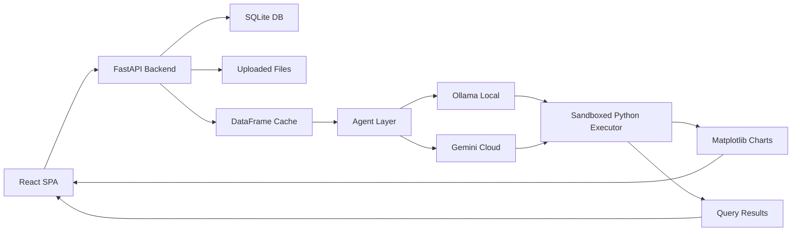

# LuminaData

A local-first data intelligence platform. Upload CSV or JSON datasets, query them in natural language, and get automated visualizations — with the option to run entirely on-device using Ollama or connect to Gemini for cloud inference.


## Problem Statement

Data exploration typically requires SQL knowledge or manual charting in spreadsheet tools. Non-technical users cannot easily ask ad-hoc questions about their own data. Existing cloud-based analytics tools introduce per-query costs and require uploading sensitive data to third-party servers.

LuminaData runs inference locally by default via Ollama, with Gemini available as an optional cloud fallback. All data processing happens on the user's machine unless they explicitly choose otherwise.

## System Overview

A React frontend communicates with a FastAPI backend. Users upload CSV or JSON files, which are stored server-side and loaded into Pandas DataFrames. Natural language queries are processed by an agent layer that constructs schema-aware prompts, routes them to the configured AI provider, sanitizes the returned Python code, executes it in an isolated namespace, and returns both computed results and chart images to the frontend.

## Architecture



## Technical Stack

| Layer | Technology | Rationale |
|---|---|---|
| Frontend | React 19 + Vite | Fast HMR, modern component model |
| State | Zustand | Minimal boilerplate, TypeScript-friendly |
| Styling | Tailwind CSS | Utility-first, consistent design system |
| Backend | FastAPI | Async support, automatic OpenAPI docs |
| Database | SQLite + SQLAlchemy | Zero-config, file-based — no server setup required |
| Auth | JWT + bcrypt | Stateless, industry standard |
| AI Providers | Ollama / Gemini | Local-first default, cloud as opt-in fallback |
| Data | Pandas + NumPy | Efficient in-memory DataFrame operations |
| Visualization | Matplotlib + Seaborn | Programmatic chart generation from executed query plans |

## Key Engineering Features

**Sandboxed Code Execution:** Query results are produced by executing generated Python code in a restricted namespace. Dangerous imports (os, sys, subprocess) are stripped before execution. Timeout limits prevent resource exhaustion. This was the core engineering challenge — stripping imports alone is insufficient; the execution environment itself must be restricted.

**Provider Abstraction Layer:** The agent module normalizes API differences between Ollama and Gemini behind a single interface. Provider switching requires no frontend changes — the active provider is injected at startup via config. System prompts are adapted per provider based on context length and capability differences.

**Schema-Aware Query Planning:** Before processing any query, the system auto-detects column types (numeric, categorical, datetime) and injects this into the prompt as structured context. This significantly reduces incorrect DataFrame operations from the AI layer.

**User Data Isolation:** JWT tokens partition user data server-side. File uploads are namespaced under user IDs. Access control is enforced at the API layer, not just the frontend.

## AI Integration

LuminaData does not train models. The AI layer handles three tasks: translating natural language queries into executable Pandas operations, selecting appropriate visualization types based on detected column types, and summarizing query results in plain English. Significant prompt engineering was required to get consistent, executable Python output — schema format, sample values, and column type hints all affect output reliability.

## Installation & Setup

**Prerequisites**
- Python 3.9+
- Node.js 18+
- Ollama (optional, for local inference)

**Backend**
```bash
cd server
pip install -r requirements.txt
```

Create `.env` in root:
JWT_SECRET=your_secret_here
PORT=8000
HOST=0.0.0.0

**Frontend**
```bash
cd client
npm install
```

**Run**
```bash
python run.py
```
Starts FastAPI on port 8000 and Vite on port 5173.

## Project Structure
```
lumina-data/
├── run.py                 # Concurrent launcher for backend + frontend
├── server/
│   ├── main.py            # FastAPI app, all routes
│   ├── auth.py            # JWT + bcrypt authentication
│   ├── models.py          # SQLAlchemy User, Dataset models
│   ├── database.py        # SQLite configuration
│   ├── data_manager.py    # DataFrame operations, sandboxed executor
│   ├── agent.py           # Provider abstraction, prompt construction
│   └── uploads/           # User-uploaded files, namespaced by user ID
├── client/
│   ├── src/
│   │   ├── App.jsx        # Main React component
│   │   └── store.js       # Zustand state management
│   └── package.json
└── data/                  # Sample datasets for testing
```
## Technical Challenges & Solutions

**Sandboxed execution security:** AI-generated Python can contain malicious operations — file I/O, network calls, infinite loops. Stripping dangerous imports is necessary but not sufficient. The solution combines import sanitization, a restricted execution namespace with no access to system modules, and timeout enforcement. Defense in depth rather than a single filter.

**Capturing Matplotlib output:** Chart figures generated inside the sandbox need to reach the frontend. The executor captures `plt.gcf()` after code runs, encodes it as base64 PNG, and returns it alongside the query result. This avoids filesystem I/O inside the sandbox.

**Prompt consistency across providers:** Ollama and Gemini have different context lengths and respond differently to the same prompt structure. The agent layer maintains provider-specific prompt templates while keeping the schema injection format consistent.

## Known Limitations

- No streaming: queries block until inference and execution complete. Large datasets cause noticeable delays.
- CSV and JSON only: Excel files and database connections require manual conversion first.
- No DataFrame persistence between sessions: files reload on each query.
- Code generation is non-deterministic: complex queries occasionally produce incorrect Pandas operations requiring re-submission.

## Future Improvements

- Query plan caching to skip re-generation for repeated queries
- Streaming responses to reduce perceived latency
- Support for Excel and direct database connections
- Incremental DataFrame updates without full re-upload

## Lessons Learned

- Sandboxed code execution requires multiple layers — no single restriction is sufficient on its own
- Prompt engineering for reliable code generation needs consistent schema formatting; inconsistent column name presentation was the main source of incorrect output
- Provider abstraction pays off early — adding Gemini support after building for Ollama took minimal effort because the interface was already normalized

## License

MIT
